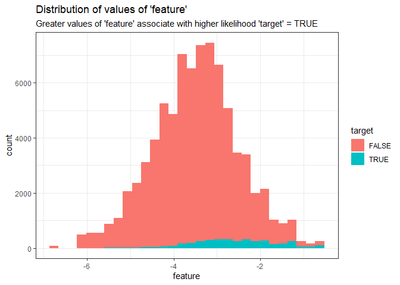
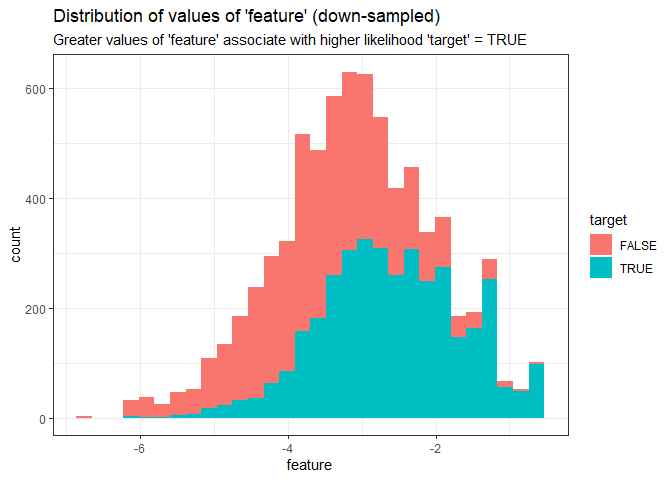
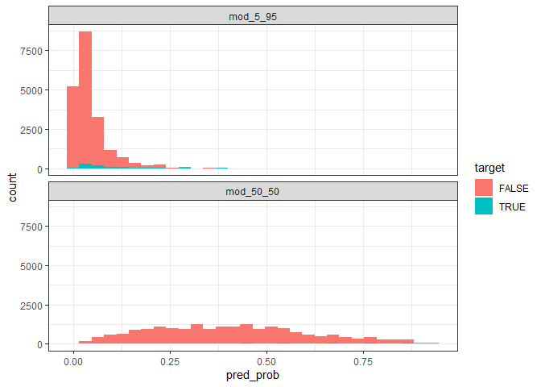
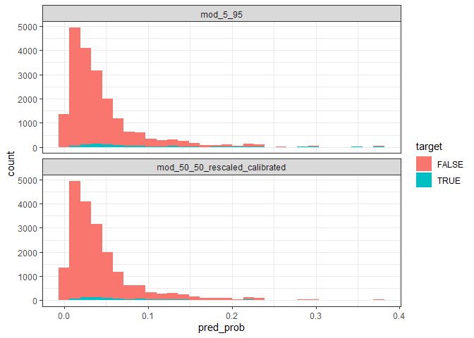
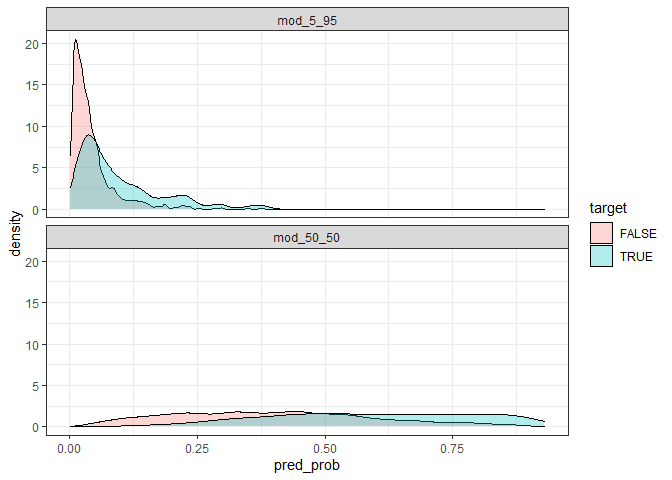
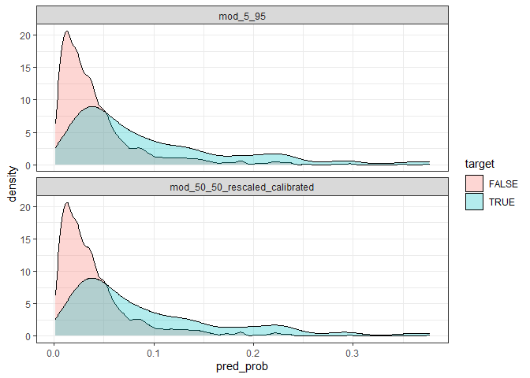
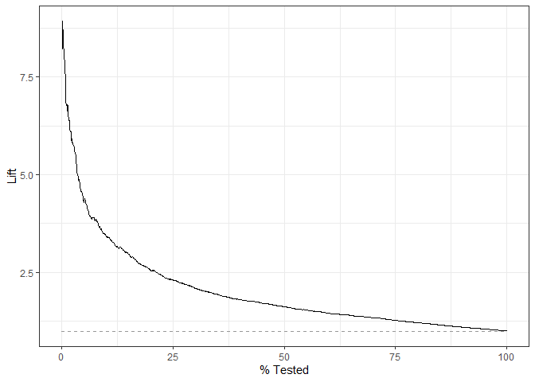

DRAFT Remember, Resampling Techniques Change the Base Rates of Your
Predictions
================
Bryan Shalloway
June 7, 2018

<!-- This chunk allows more than three levels for the Table of Contents -->

<!-- <script> -->

<!--     $(document).ready(function() { -->

<!--       $items = $('div#TOC li'); -->

<!--       $items.each(function(idx) { -->

<!--         num_ul = $(this).parentsUntil('#TOC').length; -->

<!--         $(this).css({'text-indent': num_ul * 10, 'padding-left': 0}); -->

<!--       }); -->

<!--     }); -->

<!-- </script> -->

**TLDR:** if you use over or under sampling techniques, your model’s
predicted probabilites for the minority class will be higher than they
would be if you did not use these sampling techniques (unless you adjust
your predictions in some way during post-processing or at another step).
(I expect the audience for this post to be rather limited).

People new to predictive modeling seem to often rush into using under or
over sampling procedures without understanding what these procedures are
doing. They then sometimes get confused when their predictions appear
way off (from those that would be expected according to the base rates
in their data). After having this conversation a few times (and
participants not grasping points that would become obvious upon
reflection or demonstration), I decided to write this short vignette
that walks through, a little bit more explicitly, an example of the
implications of under or over sampling procedures on the base rates of
predictions. (The code and examples are pulled largely from a few emails
from early to mid 2018, before I started using `tidymodels`.)

Note that this post is not about *why* you might want to use resampling
procedures\[1\], it is meant *only* to demonstrate that such procedures
change the base rates of your predictions (unless adjusted).

-----

*The proportion of TRUE:FALSE cases of the target in classification
problems largely determines the model’s base rate probabilities.
Therefore if you use sampling techniques that change this proportion
(e.g. you use sampling techniques to go from 5-95 to 50-50 TRUE-FALSE
rates) there is a good chance you will want to rescale / calibrate\[2\]
your predictions before using them in the wild (if you care about things
other than ranking your observations\[3\]).*

``` r
library(tidyverse)
library(modelr)
library(ggplot2)
library(gridExtra)
library(purrr)

theme_set(theme_bw())
```

# Generate Data

Generate classification data with substantial class imbalance.

``` r
# convert log odds to probability
convert_lodds <- function(log_odds) exp(log_odds) / (1 + exp(log_odds))

minority_data <- tibble(rand_lodds = rnorm(1000, log(.03 / (1 - .03)), sd = 1),
       rand_probs = convert_lodds(rand_lodds)) %>% 
  mutate(target = map(.x = rand_probs, ~rbernoulli(100, p = .x))) %>% 
  unnest() %>% 
  mutate(id = row_number())

# Change the name of the same of the variables to make the dataset more
# intuitive to follow.
example <- minority_data %>% 
  select(id, target, feature = rand_lodds)
```

*In this dataset we have a class imbalance where our `target` is
composed of \~5% positive (`TRUE`) cases and \~95% negative (`FALSE`)
cases.*

``` r
example %>% 
  count(target) %>% 
  mutate(proportion = round(n / sum(n), 3)) %>% 
  knitr::kable()
```

| target |     n | proportion |
| :----- | ----: | ---------: |
| FALSE  | 95444 |      0.954 |
| TRUE   |  4556 |      0.046 |

Make 80-20 train - test split\[4\].

``` r
set.seed(123)
train <- example %>% 
  sample_frac(0.80)

test <- example %>% 
  anti_join(train, by = "id")
```

# Association of ‘feature’ and ‘target’

We have one important feature named `feature`\[5\].

``` r
train %>% 
  ggplot(aes(feature, fill = target))+
  geom_histogram()+
  labs(title = "Distribution of values of 'feature'",
       subtitle = "Greater values of 'feature' associate with higher likelihood 'target' = TRUE")
```

<!-- -->

## Resample

Make a new sample `train_downsamp` that keeps all positive cases in the
the training set and an equal number of randomly sampled negative cases
so that the split is no longer 5-95 but becomes 50-50.

``` r
minority_class_size <- sum(train$target)

set.seed(1234)

train_downsamp <- train %>% 
  group_by(target) %>% 
  sample_n(minority_class_size) %>% 
  ungroup()
```

See below for what the distribution of `feature` looks like in the
down-sampled dataset.

``` r
train_downsamp %>% 
  ggplot(aes(feature, fill = target))+
  geom_histogram()+
  labs(title = "Distribution of values of 'feature' (down-sampled)",
       subtitle = "Greater values of 'feature' associate with higher likelihood 'target' = TRUE")
```

<!-- -->

## Build Models

Train a logistic regression model to predict positive cases for `target`
based on `feature` using the training dataset without any changes in the
sample (i.e. with the roughly 5-95 class imbalance).

``` r
mod_5_95 <- glm(target ~ feature, family = binomial("logit"), data = train)
```

Train a model with the down-sampled (i.e. 50-50) dataset.

``` r
mod_50_50 <- glm(target ~ feature, family = binomial("logit"), data = train_downsamp)
```

Add the predictions from both of these models\[6\] onto our test set
(and convert log-odd predictions to probabilities).

``` r
test_with_preds <- test %>% 
  gather_predictions(mod_5_95, mod_50_50) %>% 
  mutate(pred_prob = convert_lodds(pred))
```

Visualize distributions of predicted probability of a positive and
negative case for each model.

``` r
test_with_preds %>% 
  ggplot(aes(x = pred_prob, fill = target))+
  geom_histogram()+
  facet_wrap(~model, ncol = 1)
```

<!-- -->

The predicted probabilities for the model built with the down-sampled
50-50 dataset are much higher than those built with the original 5-95
dataset. The predictions from the down-sampled model are not accurate
predicted probabilities in their current form and would need to be
rescaled to reflect the *actual* underlying distribution of positive
cases associated with the given inputs.

# Re-scale Predictions to Predicted Probabilities

Isotonic Regression\[7\] or Platt scaling\[8\] could be used. Such
methods are used to calibrate outputted predictions and ensure they
align with *actual* probabilities. Recalibration techniques are
typically used when you have models that may not output well calibrated
probabilities\[9\]. However these methods can also be used to rescale
your outputs (as in this case). (In the case of linear models, there are
also simpler approaches available\[10\].)

``` r
mod_50_50_rescaled_calibrated <- train %>% 
  add_predictions(mod_50_50) %>% 
  glm(target ~ pred, family = binomial("logit"), data = .)
```

``` r
test_with_preds_adjusted <- test %>% 
  spread_predictions(mod_5_95, mod_50_50) %>% 
  rename(pred = mod_50_50) %>% 
  spread_predictions(mod_50_50_rescaled_calibrated) %>% 
  select(-pred) %>% 
  gather(mod_5_95, mod_50_50_rescaled_calibrated, key = "model", value = "pred") %>% 
  mutate(pred_prob = convert_lodds(pred)) 

test_with_preds_adjusted %>% 
  ggplot(aes(x = pred_prob, fill = target))+
  geom_histogram()+
  facet_wrap(~model, ncol = 1)
```

<!-- -->

Now that the predictions have been calibrated according to their
underlying base rate, you can see the distributions of the predictions
between the models look essentially the same.

# Appendix

Rebuilding plots but using density distributions by class (rather than
histogramss based on counts).

``` r
test_with_preds %>% 
  ggplot(aes(x = pred_prob, fill = target))+
  geom_density(alpha = 0.3)+
  facet_wrap(~model, ncol = 1)
```

<!-- -->

``` r
test_with_preds_adjusted %>% 
  ggplot(aes(x = pred_prob, fill = target))+
  geom_density(alpha = 0.3)+
  facet_wrap(~model, ncol = 1)
```

<!-- -->

## Lift plots

Predictions from model\[11\]:

``` r
test_with_preds_adjusted %>% 
  mutate(target = factor(target, c("TRUE", "FALSE"))) %>% 
  filter(model == "mod_5_95") %>%
  yardstick::lift_curve(target, pred) %>% 
  autoplot()
```

<!-- -->

1.  or any of a myriad of topics related to this.

2.  There are often pretty easy built-in ways to accommodate this.

3.  There are also other reasons you may not want to rescale your
    predictions but in many cases you will want to.

4.  no need for validation for this example

5.  The higher incidence of TRUE values in the target at higher scores
    demonstrates the features predictive value.

6.  One built with 5-95 split the other with a downsampled 50-50 split.

7.  Decision tree based approach

8.  Logistic regression based approach

9.  E.g. when using Support Vector Machines

10. In this case we are starting with a linear model hence we could also
    have just changed the intercept value to get the same affect.
    Rescaling methods act on the *predictions* rather than the model
    parameters. Hence these scaling methods have the advantage of being
    generalizable as they are agnostic to model type.

11. Note that predictions in the underlying data look *essentially* the
    same, I’m not sure why the histogram looks a little bit different at
    the end of the body of the post…
